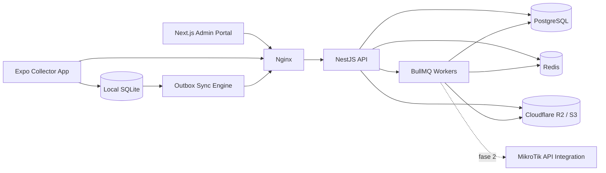
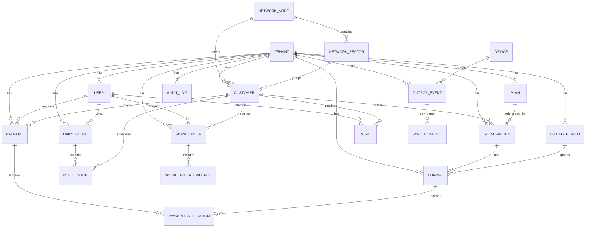

# Deluxnet Rural ISP Management Platform

Blueprint de arquitectura de producción para una plataforma SaaS multi-tenant de administración de ISP/WISP rural, diseñada para escalar de 100 a más de 20,000 clientes por operador con operación **offline-first**.

## 1. Objetivo del producto

La plataforma cubre:

- Gestión de clientes, planes, adeudos y pagos.
- Cobranza móvil offline para cobradores.
- Operación técnica y órdenes de trabajo.
- Dashboard administrativo y reportes financieros.
- Geolocalización de clientes.
- Auditoría y trazabilidad completa.
- Arquitectura preparada para integración futura con MikroTik.

## 2. Stack obligatorio

### Web

- Next.js 15
- React 19
- TypeScript
- TailwindCSS
- Shadcn/UI
- TanStack Query
- React Hook Form
- Zod
- Zustand

### Mobile

- React Native
- Expo
- Expo Router
- TypeScript
- SQLite
- Zustand
- TanStack Query

### Backend

- NestJS
- TypeScript
- Prisma ORM
- PostgreSQL

### Infraestructura y servicios

- Docker
- Docker Compose
- Nginx
- SSL
- Redis
- BullMQ
- Cloudflare R2 compatible S3

## 3. Principios de arquitectura

- **Offline first**: pagos, visitas, comprobantes, observaciones y actualizaciones de clientes deben capturarse sin conectividad.
- **Idempotencia**: toda operación crítica enviada por móvil usa `clientRequestId` y/o `idempotencyKey`.
- **Multi-tenant**: cada ISP opera aislado por `tenantId`.
- **Auditoría total**: toda operación crítica registra actor, dispositivo, IP, before/after y timestamp.
- **Escalabilidad horizontal**: API stateless, colas BullMQ, Redis para rate limit/caché y PostgreSQL con particionado futuro.
- **Seguridad por defecto**: JWT, refresh rotation, RBAC, hardening, validación, logs de seguridad.

## 4. Arquitectura de alto nivel



## 5. Dominios funcionales

1. **IAM y seguridad**
2. **Clientes**
3. **Planes y suscripciones**
4. **Facturación y adeudos**
5. **Pagos y comprobantes**
6. **Cobranza y rutas**
7. **Técnicos y órdenes de trabajo**
8. **Sincronización offline**
9. **Auditoría**
10. **Reportes y dashboard**
11. **Geolocalización**
12. **Integraciones**

## 6. Flujo offline-first

### Operaciones offline soportadas

- Registrar pago.
- Consultar clientes previamente sincronizados.
- Capturar comprobante y evidencia.
- Registrar visita.
- Registrar ubicación.
- Registrar observaciones.
- Actualizar información del cliente.

### Outbox pattern

Cada operación móvil:

1. Genera `uuid`.
2. Guarda payload en SQLite.
3. Marca estado `pending`.
4. Adjunta `deviceId`, `clientRequestId`, `occurredAt`.
5. Sincroniza al recuperar conectividad.

Estados:

- `pending`
- `syncing`
- `synced`
- `failed`

### Resolución de conflictos

- **Pagos**: nunca se duplican; el backend resuelve por `tenantId + clientRequestId`.
- **Catálogos**: último write válido con `updatedAt` y versión.
- **Cliente y visitas**: merge por campo cuando no exista colisión; si existe, crear `sync_conflicts`.
- **Archivos**: primero metadatos, luego subida binaria a R2.

## 7. Modelo de datos

### 7.1 Diagrama entidad-relación



### 7.2 Modelo relacional

- `tenants`: operador SaaS.
- `users`: usuarios internos por tenant.
- `refresh_tokens`: refresh token rotation.
- `devices`: dispositivos móviles autorizados.
- `audit_logs`: bitácora completa.
- `security_events`: eventos de seguridad.
- `network_nodes`: nodos inalámbricos.
- `network_sectors`: sectores/antenas.
- `plans`: catálogo comercial.
- `customers`: ficha comercial, técnica y geográfica.
- `subscriptions`: relación cliente-plan y ciclo de servicio.
- `billing_periods`: períodos mensuales.
- `charges`: cargos/adeudos generados.
- `payments`: cobros registrados.
- `payment_allocations`: aplicación de pago contra cargos.
- `daily_routes`: rutas de cobranza.
- `route_stops`: clientes programados en ruta.
- `visits`: historial de cobranza/seguimiento.
- `work_orders`: tickets técnicos.
- `work_order_evidences`: fotos/evidencias.
- `attachments`: archivos genéricos en R2.
- `outbox_events`: operaciones offline pendientes/sincronizadas.
- `sync_conflicts`: conflictos detectados.
- `mikrotik_profiles`: configuración futura de integración.
- `mikrotik_command_logs`: ejecución futura de comandos.

### 7.3 Prisma schema

```prisma
generator client {
  provider = "prisma-client-js"
}

datasource db {
  provider = "postgresql"
  url      = env("DATABASE_URL")
}

enum Role {
  SUPER_ADMIN
  ADMINISTRADOR
  SUPERVISOR
  COBRADOR
  TECNICO
}

enum UserStatus {
  ACTIVE
  INVITED
  BLOCKED
}

enum CustomerStatus {
  ACTIVO
  SUSPENDIDO
  MOROSO
  CANCELADO
}

enum SubscriptionStatus {
  ACTIVE
  SUSPENDED
  DELINQUENT
  CANCELLED
}

enum ChargeStatus {
  PENDING
  PARTIALLY_PAID
  PAID
  CANCELLED
}

enum PaymentMethod {
  EFECTIVO
  TRANSFERENCIA
  DEPOSITO
  TARJETA
}

enum OutboxStatus {
  PENDING
  SYNCING
  SYNCED
  FAILED
}

enum VisitType {
  COLLECTION
  FOLLOW_UP
  TECHNICAL
}

enum WorkOrderType {
  INSTALLATION
  MAINTENANCE
  TECHNICAL_VISIT
  SUSPENSION
  REACTIVATION
}

enum WorkOrderStatus {
  OPEN
  ASSIGNED
  IN_PROGRESS
  COMPLETED
  CANCELLED
}

enum AttachmentEntityType {
  CUSTOMER
  PAYMENT
  VISIT
  WORK_ORDER
}

model Tenant {
  id                 String               @id @default(cuid())
  name               String
  slug               String               @unique
  legalName          String?
  timezone           String               @default("America/Mexico_City")
  currency           String               @default("MXN")
  active             Boolean              @default(true)
  createdAt          DateTime             @default(now())
  updatedAt          DateTime             @updatedAt
  users              User[]
  devices            Device[]
  auditLogs          AuditLog[]
  securityEvents     SecurityEvent[]
  networkNodes       NetworkNode[]
  networkSectors     NetworkSector[]
  plans              Plan[]
  customers          Customer[]
  subscriptions      Subscription[]
  billingPeriods     BillingPeriod[]
  charges            Charge[]
  payments           Payment[]
  dailyRoutes        DailyRoute[]
  visits             Visit[]
  workOrders         WorkOrder[]
  workOrderEvidences WorkOrderEvidence[]
  attachments        Attachment[]
  outboxEvents       OutboxEvent[]
  syncConflicts      SyncConflict[]
  mikrotikProfiles   MikrotikProfile[]
  mikrotikCommandLogs MikrotikCommandLog[]
}

model User {
  id               String           @id @default(cuid())
  tenantId         String
  email            String
  passwordHash     String
  fullName         String
  phone            String?
  role             Role
  status           UserStatus       @default(ACTIVE)
  lastLoginAt      DateTime?
  createdAt        DateTime         @default(now())
  updatedAt        DateTime         @updatedAt
  tenant           Tenant           @relation(fields: [tenantId], references: [id], onDelete: Cascade)
  refreshTokens    RefreshToken[]
  auditLogs        AuditLog[]
  securityEvents   SecurityEvent[]
  payments         Payment[]        @relation("PaymentRegisteredBy")
  dailyRoutes      DailyRoute[]     @relation("RouteAssignedTo")
  routeStops       RouteStop[]      @relation("RouteStopCompletedBy")
  visits           Visit[]          @relation("VisitCreatedBy")
  workOrders       WorkOrder[]      @relation("WorkOrderAssignedTo")
  workOrderClosed  WorkOrder[]      @relation("WorkOrderClosedBy")
  attachments      Attachment[]     @relation("AttachmentUploadedBy")
  outboxEvents     OutboxEvent[]    @relation("OutboxCreatedBy")
  devices          Device[]

  @@unique([tenantId, email])
  @@index([tenantId, role, status])
}

model RefreshToken {
  id          String   @id @default(cuid())
  tenantId    String
  userId      String
  tokenHash   String   @unique
  expiresAt   DateTime
  revokedAt   DateTime?
  createdAt   DateTime @default(now())
  ipAddress   String?
  userAgent   String?
  user        User     @relation(fields: [userId], references: [id], onDelete: Cascade)

  @@index([userId, expiresAt])
  @@index([tenantId, userId])
}

model Device {
  id             String        @id @default(cuid())
  tenantId       String
  userId         String
  name           String
  platform       String
  appVersion     String?
  deviceUuid     String
  lastSyncAt     DateTime?
  revokedAt      DateTime?
  createdAt      DateTime      @default(now())
  tenant         Tenant        @relation(fields: [tenantId], references: [id], onDelete: Cascade)
  user           User          @relation(fields: [userId], references: [id], onDelete: Cascade)
  outboxEvents   OutboxEvent[]

  @@unique([tenantId, deviceUuid])
  @@index([tenantId, userId])
}

model AuditLog {
  id            String   @id @default(cuid())
  tenantId      String
  userId        String?
  entityType    String
  entityId      String
  action        String
  ipAddress     String?
  deviceId      String?
  userAgent     String?
  beforeData    Json?
  afterData     Json?
  createdAt     DateTime @default(now())
  tenant        Tenant   @relation(fields: [tenantId], references: [id], onDelete: Cascade)
  user          User?    @relation(fields: [userId], references: [id], onDelete: SetNull)

  @@index([tenantId, entityType, entityId, createdAt])
  @@index([tenantId, userId, createdAt])
}

model SecurityEvent {
  id            String   @id @default(cuid())
  tenantId      String
  userId        String?
  category      String
  severity      String
  description   String
  ipAddress     String?
  userAgent     String?
  metadata      Json?
  createdAt     DateTime @default(now())
  tenant        Tenant   @relation(fields: [tenantId], references: [id], onDelete: Cascade)
  user          User?    @relation(fields: [userId], references: [id], onDelete: SetNull)

  @@index([tenantId, category, createdAt])
  @@index([tenantId, severity, createdAt])
}

model NetworkNode {
  id              String          @id @default(cuid())
  tenantId        String
  name            String
  code            String
  municipality    String?
  locality        String?
  latitude        Decimal?        @db.Decimal(10, 7)
  longitude       Decimal?        @db.Decimal(10, 7)
  active          Boolean         @default(true)
  createdAt       DateTime        @default(now())
  updatedAt       DateTime        @updatedAt
  tenant          Tenant          @relation(fields: [tenantId], references: [id], onDelete: Cascade)
  sectors         NetworkSector[]
  customers       Customer[]

  @@unique([tenantId, code])
  @@index([tenantId, active])
}

model NetworkSector {
  id              String        @id @default(cuid())
  tenantId        String
  nodeId          String
  name            String
  antenna         String?
  azimuth         Int?
  active          Boolean       @default(true)
  createdAt       DateTime      @default(now())
  updatedAt       DateTime      @updatedAt
  tenant          Tenant        @relation(fields: [tenantId], references: [id], onDelete: Cascade)
  node            NetworkNode   @relation(fields: [nodeId], references: [id], onDelete: Cascade)
  customers       Customer[]

  @@unique([tenantId, nodeId, name])
  @@index([tenantId, nodeId, active])
}

model Plan {
  id                String          @id @default(cuid())
  tenantId          String
  name              String
  downloadMbps      Int
  uploadMbps        Int
  monthlyPrice      Decimal         @db.Decimal(12, 2)
  description       String?
  active            Boolean         @default(true)
  createdAt         DateTime        @default(now())
  updatedAt         DateTime        @updatedAt
  tenant            Tenant          @relation(fields: [tenantId], references: [id], onDelete: Cascade)
  subscriptions     Subscription[]

  @@unique([tenantId, name])
  @@index([tenantId, active])
}

model Customer {
  id                    String               @id @default(cuid())
  tenantId              String
  nodeId                String?
  sectorId              String?
  firstName             String
  lastName              String
  phone                 String?
  whatsapp              String?
  email                 String?
  addressLine           String
  locality              String?
  municipality          String?
  references            String?
  latitude              Decimal?             @db.Decimal(10, 7)
  longitude             Decimal?             @db.Decimal(10, 7)
  housePhotoUrl         String?
  status                CustomerStatus       @default(ACTIVO)
  ipAddress             String?
  pppoeUsername         String?
  macAddress            String?
  installedEquipment    String?
  signupDate            DateTime
  billingCutoffDay      Int
  currentBalance        Decimal              @default(0) @db.Decimal(12, 2)
  createdAt             DateTime             @default(now())
  updatedAt             DateTime             @updatedAt
  tenant                Tenant               @relation(fields: [tenantId], references: [id], onDelete: Cascade)
  node                  NetworkNode?         @relation(fields: [nodeId], references: [id], onDelete: SetNull)
  sector                NetworkSector?       @relation(fields: [sectorId], references: [id], onDelete: SetNull)
  subscriptions         Subscription[]
  payments              Payment[]
  routeStops            RouteStop[]
  visits                Visit[]
  workOrders            WorkOrder[]
  charges               Charge[]
  attachments           Attachment[]

  @@index([tenantId, status])
  @@index([tenantId, locality, municipality])
  @@index([tenantId, nodeId, sectorId])
  @@index([tenantId, billingCutoffDay, status])
}

model Subscription {
  id                String              @id @default(cuid())
  tenantId          String
  customerId        String
  planId            String
  status            SubscriptionStatus  @default(ACTIVE)
  startDate         DateTime
  endDate           DateTime?
  priceLocked       Decimal             @db.Decimal(12, 2)
  notes             String?
  createdAt         DateTime            @default(now())
  updatedAt         DateTime            @updatedAt
  tenant            Tenant              @relation(fields: [tenantId], references: [id], onDelete: Cascade)
  customer          Customer            @relation(fields: [customerId], references: [id], onDelete: Cascade)
  plan              Plan                @relation(fields: [planId], references: [id], onDelete: Restrict)
  charges           Charge[]

  @@index([tenantId, customerId, status])
  @@index([tenantId, planId, status])
}

model BillingPeriod {
  id                String      @id @default(cuid())
  tenantId          String
  code              String
  startsAt          DateTime
  endsAt            DateTime
  dueDate           DateTime
  closedAt          DateTime?
  createdAt         DateTime    @default(now())
  tenant            Tenant      @relation(fields: [tenantId], references: [id], onDelete: Cascade)
  charges           Charge[]

  @@unique([tenantId, code])
  @@index([tenantId, startsAt, endsAt])
}

model Charge {
  id                String        @id @default(cuid())
  tenantId          String
  customerId        String
  subscriptionId    String
  billingPeriodId   String
  concept           String
  amount            Decimal       @db.Decimal(12, 2)
  remainingAmount   Decimal       @db.Decimal(12, 2)
  status            ChargeStatus  @default(PENDING)
  generatedAt       DateTime
  dueDate           DateTime
  paidAt            DateTime?
  createdAt         DateTime      @default(now())
  updatedAt         DateTime      @updatedAt
  tenant            Tenant        @relation(fields: [tenantId], references: [id], onDelete: Cascade)
  customer          Customer      @relation(fields: [customerId], references: [id], onDelete: Cascade)
  subscription      Subscription  @relation(fields: [subscriptionId], references: [id], onDelete: Cascade)
  billingPeriod     BillingPeriod @relation(fields: [billingPeriodId], references: [id], onDelete: Restrict)
  allocations       PaymentAllocation[]

  @@index([tenantId, customerId, status, dueDate])
  @@index([tenantId, billingPeriodId, status])
}

model Payment {
  id                String               @id @default(cuid())
  tenantId          String
  customerId        String
  createdById       String
  folio             String
  clientRequestId   String
  method            PaymentMethod
  amount            Decimal              @db.Decimal(12, 2)
  paidAt            DateTime
  latitude          Decimal?             @db.Decimal(10, 7)
  longitude         Decimal?             @db.Decimal(10, 7)
  voucherUrl        String?
  notes             String?
  createdAt         DateTime             @default(now())
  updatedAt         DateTime             @updatedAt
  tenant            Tenant               @relation(fields: [tenantId], references: [id], onDelete: Cascade)
  customer          Customer             @relation(fields: [customerId], references: [id], onDelete: Cascade)
  createdBy         User                 @relation("PaymentRegisteredBy", fields: [createdById], references: [id], onDelete: Restrict)
  allocations       PaymentAllocation[]
  attachments       Attachment[]

  @@unique([tenantId, folio])
  @@unique([tenantId, clientRequestId])
  @@index([tenantId, paidAt])
  @@index([tenantId, customerId, paidAt])
}

model PaymentAllocation {
  id                String    @id @default(cuid())
  paymentId         String
  chargeId          String
  amount            Decimal   @db.Decimal(12, 2)
  createdAt         DateTime  @default(now())
  payment           Payment   @relation(fields: [paymentId], references: [id], onDelete: Cascade)
  charge            Charge    @relation(fields: [chargeId], references: [id], onDelete: Cascade)

  @@unique([paymentId, chargeId])
  @@index([chargeId])
}

model DailyRoute {
  id                String      @id @default(cuid())
  tenantId          String
  assignedToId      String
  routeDate         DateTime
  name              String
  status            String
  createdAt         DateTime    @default(now())
  updatedAt         DateTime    @updatedAt
  tenant            Tenant      @relation(fields: [tenantId], references: [id], onDelete: Cascade)
  assignedTo        User        @relation("RouteAssignedTo", fields: [assignedToId], references: [id], onDelete: Restrict)
  stops             RouteStop[]

  @@index([tenantId, assignedToId, routeDate])
}

model RouteStop {
  id                String      @id @default(cuid())
  routeId           String
  customerId        String
  sequence          Int
  plannedAmount     Decimal?    @db.Decimal(12, 2)
  completedAt       DateTime?
  completedById     String?
  result            String?
  notes             String?
  route             DailyRoute  @relation(fields: [routeId], references: [id], onDelete: Cascade)
  customer          Customer    @relation(fields: [customerId], references: [id], onDelete: Cascade)
  completedBy       User?       @relation("RouteStopCompletedBy", fields: [completedById], references: [id], onDelete: SetNull)

  @@unique([routeId, sequence])
  @@index([customerId])
}

model Visit {
  id                String      @id @default(cuid())
  tenantId          String
  customerId        String
  createdById       String
  type              VisitType
  notes             String?
  latitude          Decimal?    @db.Decimal(10, 7)
  longitude         Decimal?    @db.Decimal(10, 7)
  visitedAt         DateTime
  createdAt         DateTime    @default(now())
  tenant            Tenant      @relation(fields: [tenantId], references: [id], onDelete: Cascade)
  customer          Customer    @relation(fields: [customerId], references: [id], onDelete: Cascade)
  createdBy         User        @relation("VisitCreatedBy", fields: [createdById], references: [id], onDelete: Restrict)
  attachments       Attachment[]

  @@index([tenantId, customerId, visitedAt])
  @@index([tenantId, createdById, visitedAt])
}

model WorkOrder {
  id                String            @id @default(cuid())
  tenantId          String
  customerId        String
  assignedToId      String?
  closedById        String?
  type              WorkOrderType
  status            WorkOrderStatus   @default(OPEN)
  title             String
  description       String?
  scheduledAt       DateTime?
  startedAt         DateTime?
  completedAt       DateTime?
  createdAt         DateTime          @default(now())
  updatedAt         DateTime          @updatedAt
  tenant            Tenant            @relation(fields: [tenantId], references: [id], onDelete: Cascade)
  customer          Customer          @relation(fields: [customerId], references: [id], onDelete: Cascade)
  assignedTo        User?             @relation("WorkOrderAssignedTo", fields: [assignedToId], references: [id], onDelete: SetNull)
  closedBy          User?             @relation("WorkOrderClosedBy", fields: [closedById], references: [id], onDelete: SetNull)
  evidences         WorkOrderEvidence[]
  attachments       Attachment[]

  @@index([tenantId, status, type])
  @@index([tenantId, assignedToId, scheduledAt])
}

model WorkOrderEvidence {
  id                String      @id @default(cuid())
  tenantId          String
  workOrderId       String
  fileUrl           String
  caption           String?
  createdAt         DateTime    @default(now())
  tenant            Tenant      @relation(fields: [tenantId], references: [id], onDelete: Cascade)
  workOrder         WorkOrder   @relation(fields: [workOrderId], references: [id], onDelete: Cascade)

  @@index([tenantId, workOrderId])
}

model Attachment {
  id                String                @id @default(cuid())
  tenantId          String
  uploadedById      String?
  entityType        AttachmentEntityType
  entityId          String
  storageKey        String
  mimeType          String
  sizeBytes         Int
  checksum          String?
  createdAt         DateTime              @default(now())
  tenant            Tenant                @relation(fields: [tenantId], references: [id], onDelete: Cascade)
  uploadedBy        User?                 @relation("AttachmentUploadedBy", fields: [uploadedById], references: [id], onDelete: SetNull)
  payment           Payment?              @relation(fields: [paymentId], references: [id], onDelete: Cascade)
  paymentId         String?
  customer          Customer?             @relation(fields: [customerId], references: [id], onDelete: Cascade)
  customerId        String?
  visit             Visit?                @relation(fields: [visitId], references: [id], onDelete: Cascade)
  visitId           String?
  workOrder         WorkOrder?            @relation(fields: [workOrderId], references: [id], onDelete: Cascade)
  workOrderId       String?

  @@index([tenantId, entityType, entityId])
  @@index([tenantId, createdAt])
}

model OutboxEvent {
  id                String        @id @default(cuid())
  tenantId          String
  deviceId          String
  createdById       String?
  aggregateType     String
  aggregateId       String
  operation         String
  clientRequestId   String
  payload           Json
  status            OutboxStatus  @default(PENDING)
  errorMessage      String?
  attempts          Int           @default(0)
  occurredAt        DateTime
  syncedAt          DateTime?
  createdAt         DateTime      @default(now())
  updatedAt         DateTime      @updatedAt
  tenant            Tenant        @relation(fields: [tenantId], references: [id], onDelete: Cascade)
  device            Device        @relation(fields: [deviceId], references: [id], onDelete: Cascade)
  createdBy         User?         @relation("OutboxCreatedBy", fields: [createdById], references: [id], onDelete: SetNull)
  conflicts         SyncConflict[]

  @@unique([tenantId, clientRequestId])
  @@index([tenantId, status, occurredAt])
  @@index([tenantId, aggregateType, aggregateId])
}

model SyncConflict {
  id                String      @id @default(cuid())
  tenantId          String
  outboxEventId     String
  entityType        String
  entityId          String
  resolution        String?
  serverSnapshot    Json?
  clientSnapshot    Json?
  createdAt         DateTime    @default(now())
  resolvedAt        DateTime?
  tenant            Tenant      @relation(fields: [tenantId], references: [id], onDelete: Cascade)
  outboxEvent       OutboxEvent @relation(fields: [outboxEventId], references: [id], onDelete: Cascade)

  @@index([tenantId, entityType, entityId, resolvedAt])
}

model MikrotikProfile {
  id                String      @id @default(cuid())
  tenantId          String
  name              String
  routerHost        String
  routerPort        Int         @default(8728)
  pppoeServiceName  String?
  hotspotServer     String?
  queuePrefix       String?
  active            Boolean     @default(true)
  createdAt         DateTime    @default(now())
  updatedAt         DateTime    @updatedAt
  tenant            Tenant      @relation(fields: [tenantId], references: [id], onDelete: Cascade)
  commandLogs       MikrotikCommandLog[]

  @@unique([tenantId, name])
}

model MikrotikCommandLog {
  id                String      @id @default(cuid())
  tenantId          String
  profileId         String
  customerId        String?
  commandType       String
  payload           Json
  status            String
  executedAt        DateTime?
  createdAt         DateTime    @default(now())
  tenant            Tenant      @relation(fields: [tenantId], references: [id], onDelete: Cascade)
  profile           MikrotikProfile @relation(fields: [profileId], references: [id], onDelete: Cascade)

  @@index([tenantId, commandType, status, createdAt])
}
```

### 7.4 Índices críticos

- `payments (tenant_id, paid_at)`
- `payments (tenant_id, client_request_id)` único
- `charges (tenant_id, customer_id, status, due_date)`
- `customers (tenant_id, status, billing_cutoff_day)`
- `outbox_events (tenant_id, status, occurred_at)`
- `audit_logs (tenant_id, entity_type, entity_id, created_at)`
- `work_orders (tenant_id, status, type)`

### 7.5 Estrategia de particionado futuro

- **Por rango mensual**: `payments`, `audit_logs`, `security_events`, `outbox_events`.
- **Por tenant hash + rango** cuando existan tenants grandes.
- **Archivos** fuera de PostgreSQL; solo metadatos en DB.
- **Read replicas** para reportes.

## 8. Arquitectura backend NestJS

### Estructura modular

```text
apps/api/src
├── app.module.ts
├── main.ts
├── common/
│   ├── auth/
│   ├── decorators/
│   ├── filters/
│   ├── guards/
│   ├── interceptors/
│   ├── pipes/
│   └── utils/
├── config/
├── modules/
│   ├── auth/
│   ├── users/
│   ├── tenants/
│   ├── customers/
│   ├── plans/
│   ├── subscriptions/
│   ├── billing/
│   ├── payments/
│   ├── collection-routes/
│   ├── visits/
│   ├── work-orders/
│   ├── dashboard/
│   ├── reports/
│   ├── attachments/
│   ├── sync/
│   ├── audit/
│   ├── geolocation/
│   └── mikrotik/
└── jobs/
    ├── delinquency.processor.ts
    ├── auto-suspension.processor.ts
    ├── auto-reactivation.processor.ts
    └── sync-retry.processor.ts
```

### Capas por módulo

- `controller`
- `dto`
- `application/use-cases`
- `domain/entities`
- `domain/repositories`
- `infrastructure/prisma-repositories`
- `mappers`

### Endpoints REST principales

#### Auth

- `POST /auth/login`
- `POST /auth/refresh`
- `POST /auth/logout`
- `GET /auth/me`

#### Clientes

- `GET /customers`
- `POST /customers`
- `GET /customers/:id`
- `PATCH /customers/:id`
- `POST /customers/:id/suspend`
- `POST /customers/:id/reactivate`

#### Planes y suscripciones

- `GET /plans`
- `POST /plans`
- `PATCH /plans/:id`
- `POST /subscriptions`
- `PATCH /subscriptions/:id`

#### Facturación y adeudos

- `GET /billing/periods`
- `POST /billing/periods/generate`
- `GET /charges`
- `GET /customers/:id/debt-summary`

#### Pagos

- `GET /payments`
- `POST /payments`
- `GET /payments/:id`
- `POST /payments/:id/receipt`

#### Cobranza

- `GET /routes/daily`
- `POST /routes/daily`
- `GET /routes/:id`
- `POST /visits`

#### Técnicos

- `GET /work-orders`
- `POST /work-orders`
- `PATCH /work-orders/:id`
- `POST /work-orders/:id/evidences`

#### Sincronización

- `POST /sync/outbox/batch`
- `GET /sync/bootstrap`
- `POST /sync/conflicts/:id/resolve`

#### Dashboard y reportes

- `GET /dashboard/summary`
- `GET /reports/daily-income`
- `GET /reports/monthly-income`
- `GET /reports/collector-performance`
- `GET /reports/delinquency`
- `GET /reports/payments/export.xlsx`
- `GET /reports/payments/export.pdf`

### DTOs clave

- `CreateCustomerDto`
- `UpdateCustomerDto`
- `CreatePlanDto`
- `CreatePaymentDto`
- `AllocatePaymentDto`
- `CreateDailyRouteDto`
- `CreateVisitDto`
- `CreateWorkOrderDto`
- `SyncBatchDto`

### Casos de uso clave

- Registrar pago idempotente.
- Generar cargos mensuales.
- Calcular morosidad.
- Suspender clientes vencidos.
- Reactivar clientes pagados.
- Resolver batch de sincronización.
- Emitir auditoría por operación crítica.

### Swagger

- `/docs` protegido para roles `SUPER_ADMIN` y `ADMINISTRADOR`.
- Documentación segmentada por tags de módulo.
- Ejemplos de payload para batch sync y pagos offline.

## 9. Frontend web con Next.js 15

### Estructura

```text
apps/web
├── src/
│   ├── app/
│   │   ├── (auth)/
│   │   ├── (dashboard)/
│   │   │   ├── dashboard/
│   │   │   ├── customers/
│   │   │   ├── plans/
│   │   │   ├── payments/
│   │   │   ├── billing/
│   │   │   ├── routes/
│   │   │   ├── work-orders/
│   │   │   ├── reports/
│   │   │   ├── map/
│   │   │   └── settings/
│   ├── components/
│   ├── features/
│   ├── hooks/
│   ├── lib/
│   ├── services/
│   ├── store/
│   └── schemas/
```

### Pantallas

- Login y recuperación de sesión.
- Dashboard ejecutivo.
- Listado, detalle y edición de clientes.
- CRUD de planes.
- Registro y consulta de pagos.
- Vista de adeudos por cliente.
- Gestión de rutas de cobranza.
- Órdenes de trabajo.
- Reportes exportables.
- Mapa de clientes.
- Configuración y usuarios.

### Componentes principales

- `DataTable`
- `EntityFilters`
- `CustomerForm`
- `PaymentForm`
- `DebtSummaryCard`
- `CollectorPerformanceChart`
- `CustomersMap`
- `WorkOrderBoard`

### Estado y validación

- TanStack Query para cache y sincronización remota.
- Zustand para UI state, filtros, sesión y preferencias temporales.
- React Hook Form + Zod para formularios.

## 10. App móvil Expo offline-first

### Estructura

```text
apps/mobile
├── app/
│   ├── (auth)/
│   ├── (tabs)/
│   │   ├── dashboard.tsx
│   │   ├── route.tsx
│   │   ├── customers.tsx
│   │   ├── payments.tsx
│   │   └── sync.tsx
├── src/
│   ├── database/
│   ├── repositories/
│   ├── sync/
│   ├── services/
│   ├── store/
│   ├── features/
│   └── schemas/
```

### SQLite local

Tablas mínimas:

- `customers`
- `plans`
- `routes`
- `route_stops`
- `payments`
- `visits`
- `attachments`
- `outbox_events`
- `sync_metadata`

### Motor de sincronización

- Pull inicial de bootstrap por fecha/versionado.
- Cola local ordenada por `occurredAt`.
- Retries exponenciales.
- Sincronización en foreground y background.
- Estado visible para el cobrador.

### Estrategia de conflictos

- Pago duplicado: servidor responde `200` con recurso existente.
- Cliente modificado localmente y remotamente: registrar conflicto y pedir resolución.
- Archivos pendientes: reintentar subida separada.

## 11. Dashboard e indicadores

- Ingresos del día.
- Ingresos del mes.
- Clientes activos.
- Clientes suspendidos.
- Clientes morosos.
- Nuevos clientes.
- Pagos pendientes de sincronizar.
- Cobranza por cobrador.
- Crecimiento mensual.

## 12. Reportes

- Ingresos diarios.
- Ingresos mensuales.
- Cobranza por usuario.
- Morosidad.
- Clientes activos.
- Clientes suspendidos.
- Historial de pagos.
- Exportación Excel.
- Exportación PDF.

## 13. Geolocalización

- Mapa de clientes por estado.
- Filtros por nodo, cobrador y zona.
- Coordenadas validadas al alta.
- Heatmap futuro de morosidad por sector.

## 14. Auditoría

Cada evento crítico registra:

- usuario
- fecha/hora
- IP
- dispositivo
- acción
- cambios realizados

Eventos auditados:

- login/logout
- creación/edición de clientes
- generación de cargos
- registro y reversa de pagos
- suspensión/reactivación
- resolución de conflictos
- cambios de roles

## 15. Seguridad

- JWT access token corto.
- Refresh token rotativo con hash.
- RBAC por guard en NestJS.
- Rate limiting con Redis.
- Zod en frontend y class-validator/zod contract en backend.
- Sanitización de strings de entrada.
- Headers seguros en Nginx.
- Protección CSRF en formularios con cookie/session cuando aplique.
- Logs de seguridad para intentos fallidos, token reuse, cambios críticos.
- Cifrado de secretos y URLs firmadas para archivos.

## 16. Integración MikroTik fase 2

Diseño preparado para:

- suspensión automática por morosidad
- reactivación automática al pagar
- integración PPPoE, Hotspot y Simple Queues
- colas asíncronas con reintento
- bitácora de comandos y reconciliación

## 17. DevOps

### Monorepo sugerido

```text
apps/
  api/
  web/
  mobile/
packages/
  ui/
  config/
  contracts/
infra/
  nginx/
  docker/
  scripts/
```

### Dockerfiles requeridos

- `apps/api/Dockerfile`
- `apps/web/Dockerfile`
- `infra/nginx/Dockerfile`

### Docker Compose

Servicios:

- `web`
- `api`
- `worker`
- `postgres`
- `redis`
- `nginx`

### Variables de entorno

- `DATABASE_URL`
- `REDIS_URL`
- `JWT_SECRET`
- `JWT_REFRESH_SECRET`
- `S3_ENDPOINT`
- `S3_ACCESS_KEY`
- `S3_SECRET_KEY`
- `S3_BUCKET`
- `APP_BASE_URL`
- `NEXT_PUBLIC_API_URL`
- `RATE_LIMIT_WINDOW_MS`
- `RATE_LIMIT_MAX`

### CI/CD

Pipeline recomendado:

1. Instalar dependencias.
2. Lint.
3. Unit tests.
4. Build `api` y `web`.
5. Prisma validate/migrate check.
6. Security scan.
7. Build de imágenes Docker.
8. Deploy por ambiente.

### Backups y observabilidad

- Backups PostgreSQL diarios + PITR.
- Versionado y lifecycle en R2.
- Logs centralizados.
- Métricas Prometheus/Grafana.
- Trazas OpenTelemetry.
- Alertas por errores de sync, pagos fallidos y morosidad anómala.

## 18. Roadmap de implementación

### Fase 1

- IAM
- Clientes
- Planes
- Suscripciones
- Adeudos
- Pagos
- Cobranza offline
- Dashboard básico

### Fase 2

- Órdenes técnicas
- Reportes avanzados
- Geomapa
- Integración MikroTik

### Fase 3

- Multi-sucursal
- Billing automatizado
- Reglas avanzadas de cobranza
- BI y forecast

## 19. Decisiones clave

- **SaaS multi-tenant** desde el inicio para soportar múltiples proveedores.
- **Outbox pattern** para soportar operación real en campo sin conectividad.
- **Prisma + PostgreSQL** para consistencia transaccional y evolución controlada.
- **BullMQ** para procesos programados y asíncronos.
- **R2/S3** para comprobantes y evidencia fotográfica.

## 20. Resultado esperado

Este repositorio queda definido como la base de diseño de una plataforma comercial lista para ejecución técnica, con:

- arquitectura escalable
- modelo de datos completo
- Prisma schema base
- módulos backend
- diseño web y móvil
- estrategia offline-first
- lineamientos de seguridad y DevOps

Siguiente paso recomendado: scaffold del monorepo con `apps/api`, `apps/web`, `apps/mobile` y `packages/contracts` usando la estructura anterior.
